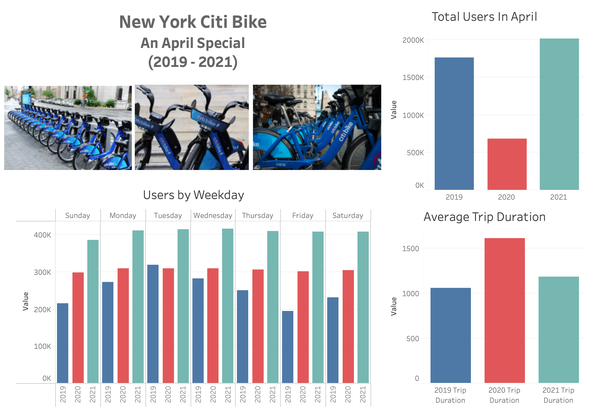
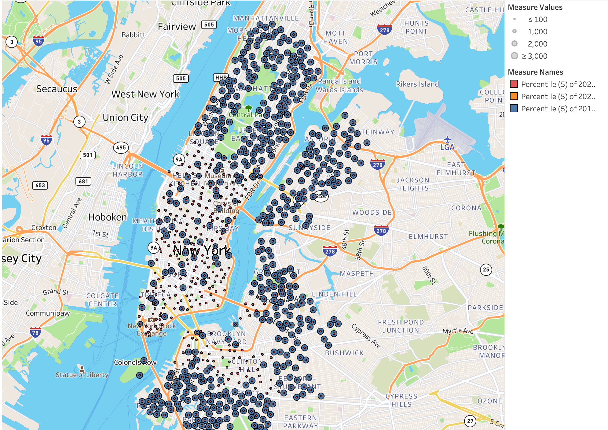
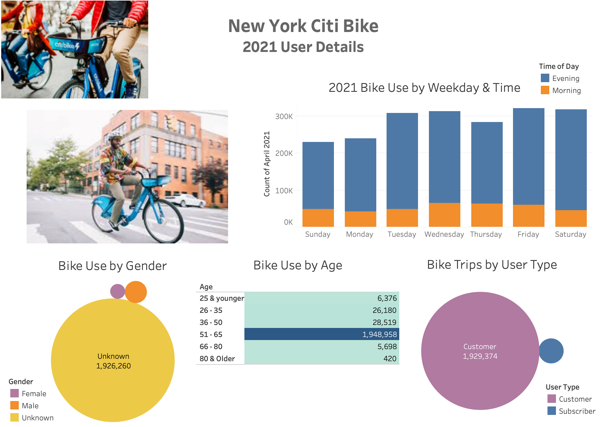
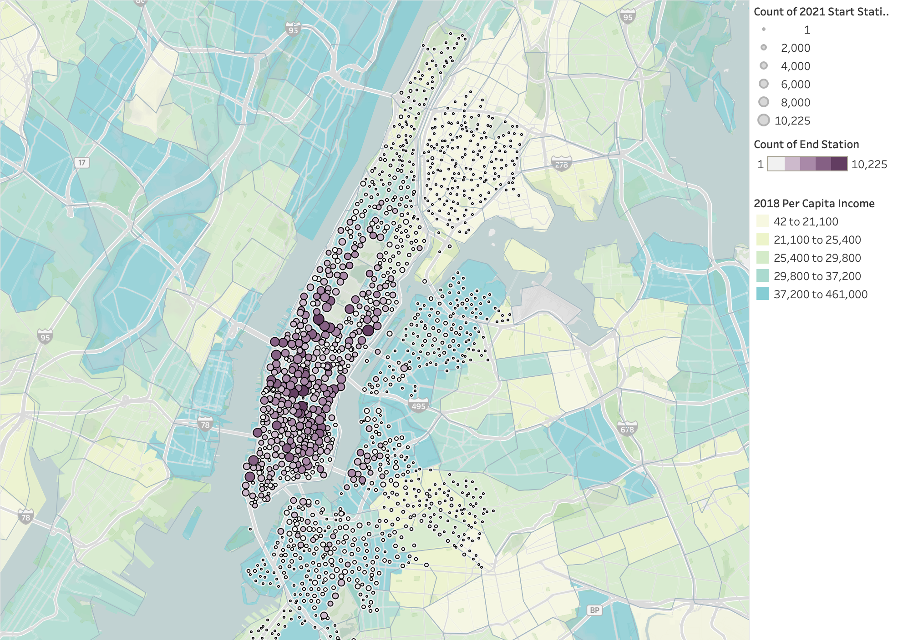

# New York Citi Bike Analysis

## Background

As the new lead analyst for the [New York Citi Bike](https://en.wikipedia.org/wiki/Citi_Bike) Program, you are now responsible for overseeing the largest bike sharing program in the United States. In your new role, you will be expected to generate regular reports for city officials looking to publicize and improve the city program.

Since 2013, the Citi Bike Program has implemented a robust infrastructure for collecting data on the program's utilization. Through the team's efforts, each month bike data is collected, organized, and made public on the [Citi Bike Data](https://www.citibikenyc.com/system-data) webpage.

However, while the data has been regularly updated, the team has yet to implement a dashboard or sophisticated reporting process. City officials have several questions on the program, so your first task on the job is to build a set of data reports to provide the answers.

## Analysis of COVID Impact

We all know that COVID has impacted the way we work and our ability to provide services--Citi Bike is no different. This analysis provides a two-part overview that would allow leadership to determine how best to react to changes in ridership during an unprecedented event by focus first on a year over year comparison and focusing on the demographic of usage in the most current year. 

This project uses Tableau to uncover trends in rider usage. All files for this project can be found [here](https://drive.google.com/drive/folders/1s2zBckzK5RqzzKSW-0h4mfeyZiAveguo?usp=sharing). 

### Year Over Year Comparison (2019 - 2021)

**Questions**

The visualizations from this analysis aimed to answer the following:
* How has ridership & usage changed, with specific attention around 2020, over the years?
* What day of the week are most people riding?
* What is the average length of trip? 
* What are the least used stations? 

**Analysis**

These visualizations + analysis above showed several things: 

* While there was a drop in ridership in 2020, there is has been a great increase of ridership to date strong than pre-pandemic years.
* Most people ride on the weekend which means the people using this service most may be those visiting the city.
* Most trips relatively shorter than they were in 2020.
* The Bottom 5% map shows that the least used stations are further out. This means, if cutting funds were needed, these stations should be considered for pause. 

### A Detailed Look at 2021

**Questions**

The visualizations from this 2021 focused analysis aimed the answer the following:
* What day of the week do most people ride?
* What time of day do most people ride?
* What age range utilizes Citi Bike most often? 
* Do males or females ride more often?
* What type of user (subscribed or customer) rides more often?
* Where are bike stations located?
* What are the most popular starting and ending locations?

**Analysis**

From the above analysis the following was noted:

* Most people ride either mid-week or on the weekend.
* Regardless of the day, most people ride after noon which likely means that very few people are using these as part of their morning commute. 
* Those 51-65 are most likely to use the service. 
* Most users do not provide their gender. 
* Most of those who use this service are not subscribers so they may be visiting the city or using as needed for longer distances. 

 
